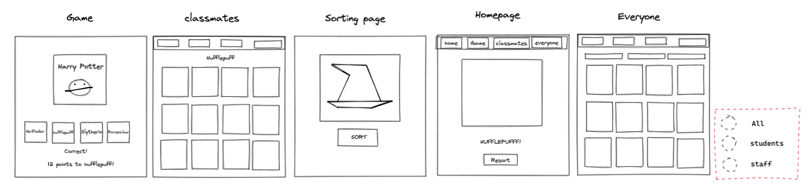
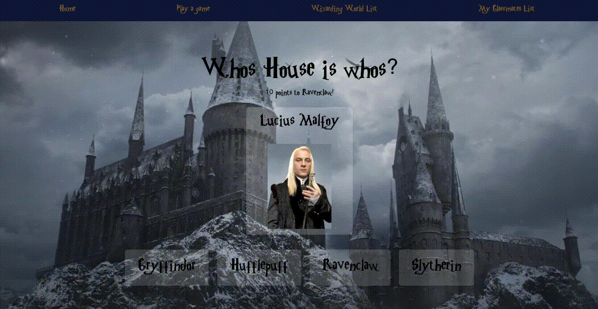
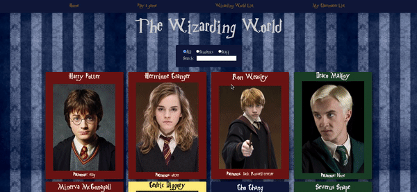

# Project 2

Project 2 on the GA Software Engineering Immersive course was to build a React application that consumes a public API.

This project was paircoded with [gabriel-arafa](https://github.com/gabriel-arafa).

Unfortunately we are unable to deploy our app due to using a http API but I have included plenty of images to demonstrate.

## Timeframe

2 days

## Technologies used

- HTML
- CSS
- JavaScript
- React
- Axios

## Planning our app

We decided to use a harry potter API that had information on all the characters in the wizarding world. We would then create a game and a year book type page with all the characters.



## Sorting

We also created a sorting page that would randomly sort you into a house. Once sorted, the nav bar and background would change depending on what house you were in.


The house colours and theme would stay on each page throughout the website. If you click re-sort, it will reassign your house and the colours will change.


I did this by using Math.random to assign the user to a house and then setting the item in local storage. I also used local storage to keep the users name and add them to the marauders map on the homepage.

## The game

The game was another part of the project I was responsible for. The aim of the game is to guess the house each character belongs to. If you guess correctly, 5 points will be added to your house. If you are wrong, 5 points will be deducted. You have 10 guesses to get as many points as you can. Cards are picked at random.

I first started by removing any characters without a house and without an image. I did this when I fetched the data.

```javascript
React.useEffect(() => {
  const getData = async () => {
    try {
      const { data } = await hpApi();
      setPotterData(
        data.filter((person) => person.image !== '' && person.house !== '')
      );
    } catch (err) {
      console.error(err);
    }
  };
  getData();
}, []);
```

I also created a function that gets the next card at random and adds to the amount of goes we have taken (we only have 10).

```javascript
function getNextCard() {
  setRandomPerson(Math.floor(Math.random() * potterData.length));
  setGoes(goes + 1);
}
```



We also need a function that checks if our answer is correct!

```javascript
function checkAnswer(event) {
  const yourAnswer = event.target.innerText;
  const correctAnswer = potterData[randomPerson].house;
  if (yourAnswer === correctAnswer) {
    setPoints(points + 10);
    setPointsText(`10 points to ${currentHouse}!`);
    getNextCard();
  } else {
    setPointsText(
      `5 points will be taken from ${currentHouse} for your serious lack of judgement...`
    );
    getNextCard();
  }
}
```

Here I am comparing the button the user clicked with the characters house on the current card. Once we have added or deducted points, we notify the user if they answered correctly, and then get the next card.

## Wins

I think we did well to make it an interactive user experience with the house points, house decoration and the user’s name.

I also think we worked well as a team, communication was a big factor in this. We would code together on zoom, and then split off onto seperate tasks. Once we came back together we would talk through the code we have done and merge on Github.

## Known bugs

Our search bar on the wizarding page has a few issues that need sorting. Firstly, it is case sensitive, which means that if I typed "ron" it wouldnt give us Ron Weasley in the results. Secondly, once you remove the text from your search to type a new word, it doesnt go back to all of the results.



## Future functionality

We would have liked to play around with the game more, adding harder levels including characters without images. Adding hints that the user can click on would also be a good idea, eg. If they clicked hint, more information about that character would come up.
